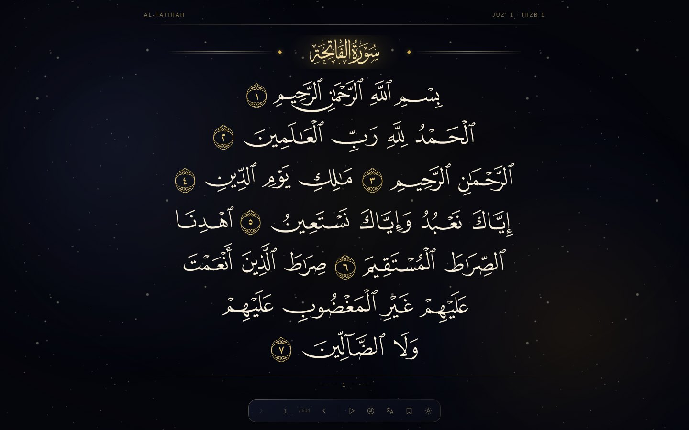

# Celestial Muṣḥaf

A web Muṣḥaf that keeps the exact fifteen-line Uthmani page — every line break,
every illuminated sūrah header, every centered closing line where the printers
put it — and sets it in obsidian and gold.

Everything that is not the text is summoned rather than resident. Touch a word
and a small glass pill appears where your finger is, offering recitation,
translation and a bookmark; touch elsewhere and it goes. The reading surface
stays clear.



---

## What makes it page-faithful

The Muṣḥaf is rendered with the KFGQPC **QCF V2** fonts, in which every word of
every page is a single pre-shaped glyph, already stretched so the line comes out
justified. There is one font per printed page — 604 of them — and they are
loaded on demand.

That approach has one dangerous property, and the codebase is organised around
it: **the glyph codes are not characters.** Every page's codes start at the same
codepoint, so rendering page N's codes in page M's font paints different, wrong
Qurʾānic text without erroring. So nothing renders in glyph mode until that
exact page's font is confirmed loaded, and until then the real Unicode Uthmani
is shown instead.

Three other decisions follow from measurement rather than taste:

- **Line breaks are resolved at build time, not fetched.** The public API serves
  page layout from more than one backing table and they disagree — identical
  requests for page 591 returned layouts a full line apart. A drift of one line
  moves a sūrah header onto an occupied line. So `scripts/bake-layout.mjs`
  resolves all 604 pages once, against the host the reference client uses, and
  checks the result in (160 KB).
- **Type size is derived, not chosen.** Measured over 453 full lines across 36
  pages, every line of the Muṣḥaf is 15.31–16.06 em wide — because the glyphs
  carry their own justification. So the page is exactly 16.1 em wide and the
  type size is whatever makes that fit. Size it any other way and flex
  justification opens gulfs between words the printed page does not have.
- **Centered lines come from a table.** "Centre the line that closes a sūrah"
  over-centres badly: most closing lines still fill the measure exactly. Only a
  small fixed set is genuinely short.

The reasoning, the measurements and the dead ends are written up in
[`docs/RESEARCH.md`](docs/RESEARCH.md).

---

## Running it

```bash
npm install
npm run dev          # http://localhost:3000
```

```bash
npm run build && npm run start
npm run typecheck
npm run bake:layout  # re-resolve the 604-page layout (rarely needed)
```

No API keys are required. Text and translations come from the Quran.com content
API, fonts and audio from the Quran CDN.

---

## Reading it

| | |
|---|---|
| Turn the page | `←` `→`, or the dock arrows. In a right-to-left book, left is forward. |
| Summon the context pill | Touch or click any word |
| Dismiss it | `Esc`, or touch anywhere else |
| Navigate | The compass — sūrah, juzʾ, or a page number |
| Everything else | The dock, which fades back until you approach it |

---

## How it is put together

```
src/
  lib/quran/
    layout.ts        page assembly — baked line breaks, API fallback
    client.ts        cached API access, split across content and audio hosts
    centering.ts     the lines the printers set centered
    fonts.ts         per-page glyph font identity
    useGlyphFont.ts  font loading, and the guard against rendering wrong text
    useRecitation.ts playback with word-level highlighting
  components/
    mushaf/          the page: lines, sūrah banners, basmala, chrome
    celestial/       starfield and aurora
    meta/            the summoned layer — pill, dock, panels
  data/
    mushaf-layout.json   604 pages of line breaks, resolved at build time
scripts/
  bake-layout.mjs    regenerates the above
```

The reader is a Next.js app. Page content is assembled server-side and cached
hard — page 231 of the Muṣḥaf will not change — so turning pages is a fetch from
a warm cache, and the neighbours are prefetched during idle time.

---

## Accessibility

Glyph fonts produce text that is not text: a screen reader meets a private-use
codepoint and has nothing to say. So the glyph layer is `aria-hidden` and every
page also carries the **real Uthmani text** in a visually-hidden element that
stays in the accessibility tree, with a heading naming the page and juzʾ.

Beyond that, settings offer a **Unicode text mode** that trades the exact line
breaks for selectable, resizable, screen-reader-native script. The
page-faithful Muṣḥaf is a visual feature, not the only way to read.

Ambience respects `prefers-reduced-motion`, drops to a single layer on
low-memory devices, is skipped entirely under Data Saver, and pauses when the
tab is hidden.

---

## Credits and licensing

The Qurʾānic text, the QCF glyph fonts and the recitations are not this
project's to license.

- **KFGQPC** (King Fahd Glorious Qurʾān Printing Complex) — the QCF V2 page
  fonts and the sūrah-name font. Free to use and distribute; **not** to modify,
  subset or sell. They are referenced from the public CDN rather than re-cut.
- **Quran.com / Quran Foundation** — the text, translations and word timings.
- **Reciters** — recitations served from the Quran CDN.

The code in this repository is available under the MIT licence.
